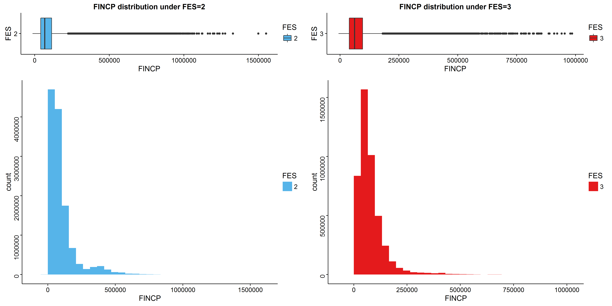
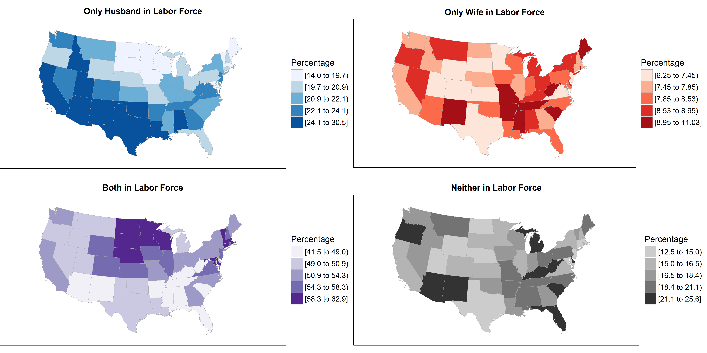
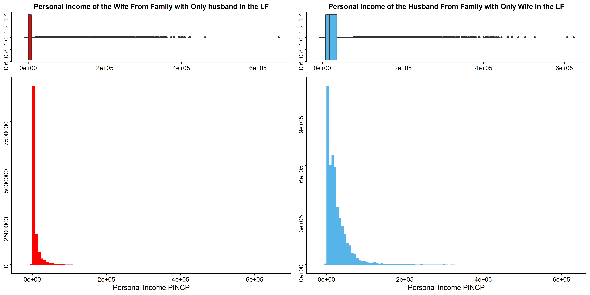

## Load libraries

```{r, message=FALSE}
library("dplyr") # for data wrangling
library("data.table") # for data handling
library("ggplot2") # for plotting
library("choroplethr") # for mapping
library("choroplethrMaps") # contains state map
library("mapproj") # contains projections
library("gridExtra") # allows multiple ggplot2 plots on the same window
library("RColorBrewer") # colors!
library("splitstackshape") # for assistance with weighting
library("cowplot") # for saving plots
source("../lib/state_choropleth_wl.R") # modified state_choropleth function that removes labels
```

## Getting to know the basics of the data  
```{r echo = FALSE}
hp <- readRDS("../data/hp.RDS")
```

There are a total of 1,476,313 households and 3,249,588 people in the sample. In this analysis we focus on a subset of the households via the variable __FES__ (Family Type and Employment Status), looking only at married-couple families.

```{r}
table(hp$FES, useNA = "ifany")
sum(table(hp$FES)[1:4])
```

## What are we focusing on?  

There are 759,782 missing values in __FES__ in the sample, and our subset will have 1,896,480 people (617,090 families). In our subset, __FES__ has four categories:  
1. Married-couple family, both husband and wife in the labor force  
2. Married-couple family, only husband in the labor force
3. Married-couple family, only wife in the labor force  
4. Married-couple family, neither husband nor wife in the labor force  

To be "in the labor force" means that one is a civilian above 18 years of age who is either employed, or unemployed and seeking work.  

We merge in a .csv file matching full state names and state abbreviations by PUMS state ID. We then create two separate datasets, one to be weighted using the household weight variable __WGTP__ and the other to be weighted using the person weight variable __PWGTP__.  

```{r}
statenames <- read.csv("../data/statenames.csv", strip.white = TRUE)
statenames <- rename(statenames, ST = code, ST_name = name, ST_abbr = abbr)
hp <- tbl_df(hp)
hp <- left_join(hp, statenames)
hp_fes1to4_wgtp <- select(hp, SERIALNO, WGTP, FES, ST_name, FINCP, MAR, SEX, INDP2, SCHL) %>% 
              filter(FES >= 1 & FES <= 4) %>% 
              distinct(SERIALNO)
hp_fes1to4_pwgtp <- select(hp, PWGTP, FES, FINCP, PINCP, MAR, SEX, INDP2, SCHL) %>% 
              filter(FES >= 1 & FES <= 4)
rm(hp)
```

## Families with Single-Earning Husbands vs. Single-Earning Wives  

We are mainly interested in comparing families in which only the husband is in the labor force versus families in which only the wife is in the labor force. Are there any obvious differences between these subgroups of families along the following:  
* total family income, which might include both the money made by whoever is in the labor force plus any passive income earned by that person's spouse, as well as other family members?  
* education level of the person in the labor force?  
* industry type of the person in the labor force?  

```{r echo = FALSE}
FINCP_FES2<-hp_fes1to4_wgtp %>%
  filter(FES == 2)
FINCP_FES2 <- expandRows(FINCP_FES2, "WGTP")
FINCP_FES3<-hp_fes1to4_wgtp %>%
  filter(FES == 3)
FINCP_FES3 <- expandRows(FINCP_FES3, "WGTP")

FINCP_FES2$FES <- as.factor(FINCP_FES2$FES)
FINCP_FES3$FES <- as.factor(FINCP_FES3$FES)
```

```{r echo = FALSE, eval = FALSE}
plot1 <- ggplot(FINCP_FES2, aes(x=FES, y=FINCP,fill=FES))+geom_boxplot()+coord_flip()+
  ggtitle("FINCP distribution under FES=2")+scale_fill_manual(values="#56B4E9")

plot3 <- ggplot(FINCP_FES2, aes(FINCP,fill=FES)) + geom_histogram()+theme(axis.text.y=element_text(angle = 90), axis.title.y=element_text(angle = 90))+scale_fill_manual(values="#56B4E9")


plot2 <- ggplot(FINCP_FES3, aes(x=FES, y=FINCP,fill=FES))+geom_boxplot()+coord_flip()+
  ggtitle("FINCP distribution under FES=3")+scale_fill_brewer(palette="Set1")

plot4 <- ggplot(FINCP_FES3, aes(FINCP,fill=FES)) + geom_histogram()+theme(axis.text.y=element_text(angle = 90), axis.title.y=element_text(angle = 90))+scale_fill_manual(values=c("green"))+scale_fill_brewer(palette="Set1")

first_plot <- grid.arrange(plot1, plot2, plot3, plot4, ncol=2, nrow=2, widths=c(1,1),heights=c(1, 3))
```

```{r}
summary(FINCP_FES2$FINCP)
summary(FINCP_FES3$FINCP)
```

The combined boxplot and histogram show fairly unsurprising income distributions, with large right skews. Median income is similar for both groups, but outliers are stronger among families with only the husband in the labor force compared to familes with only the wife in the labor force. Based on weighted estimates, there are around 12.5 million families where only the husband is in the labor force, compared to only 4.5 million families vice-versa. Notice also that the bin on the right peaks at a slightly higher amount than on the left.  

```{r echo = FALSE}
SCHLcode<-"SCHL,EDU
01,No schooling completed
02,Nursery school preschool   
03,Kindergarten
04,Grade 1
05,Grade 2
06,Grade 3        
07,Grade 4
08,Grade 5
09,Grade 6
10,Grade 7        
11,Grade 8  
12,Grade 9
13,Grade 10
14,Grade 11        
15,12th grade no diploma   
16,Regular high school diploma
17,GED or alternative credential
18,Some college but less than 1 year
19,1 or more years of college credit no degree
20,Associate's degree     
21,Bachelor's degree
22,Master's degree
23,Professional degree
24,Doctorate degree
"

SCHLcode <- fread(SCHLcode)
#remember the order of the education so that the the plot will also be drawn in this order
order <- SCHLcode$EDU
hp_fes1to4_pwgtp <-left_join(hp_fes1to4_pwgtp, SCHLcode)

hp_fes1to4_pwgtp$EDU[hp_fes1to4_pwgtp$SCHL<=3]<-"01.Kindergarten"
hp_fes1to4_pwgtp$EDU[hp_fes1to4_pwgtp$SCHL>3 & hp_fes1to4_pwgtp$SCHL<9]<-"02.Primary School"
hp_fes1to4_pwgtp$EDU[hp_fes1to4_pwgtp$SCHL>8 & hp_fes1to4_pwgtp$SCHL<16]<-"03.Middle School"
hp_fes1to4_pwgtp$EDU[hp_fes1to4_pwgtp$SCHL>15 & hp_fes1to4_pwgtp$SCHL<21]<- "04.High School"
hp_fes1to4_pwgtp$EDU[hp_fes1to4_pwgtp$SCHL == 21]<- "05.Bachelor's degree"
hp_fes1to4_pwgtp$EDU[hp_fes1to4_pwgtp$SCHL == 22]<- "06.Master's degree"
hp_fes1to4_pwgtp$EDU[hp_fes1to4_pwgtp$SCHL == 23]<- "07.Professional degree"
hp_fes1to4_pwgtp$EDU[hp_fes1to4_pwgtp$SCHL == 24]<- "08.Doctorate degree"
```

Next, we look at how these two groups differ across the levels of education of the person in the labor force, using a recoded version of the __SCHL__ variable with less categories.  
```{r echo = FALSE}
FINCP_FES2<- hp_fes1to4_pwgtp %>%
  filter(FES == 2, MAR == 1, SEX == 1) %>%  
  arrange(SCHL)
FINCP_FES2 <- expandRows(FINCP_FES2, "PWGTP")
FINCP_FES3<- hp_fes1to4_pwgtp %>%
  filter(FES == 3, MAR == 1, SEX == 2) %>%  
  arrange(SCHL)
FINCP_FES3 <- expandRows(FINCP_FES3, "PWGTP")

#set
FINCP_FES2$FES <- as.factor(FINCP_FES2$FES)
FINCP_FES2$EDU <- as.factor(FINCP_FES2$EDU)
FINCP_FES3$FES <- as.factor(FINCP_FES3$FES)
FINCP_FES3$EDU <- as.factor(FINCP_FES3$EDU)
```

```{r echo = FALSE, eval = FALSE}
left <- ggplot(FINCP_FES2, aes(x=FES, y=FINCP,fill=EDU))+geom_boxplot(mapping = NULL, 
                                                                      data = NULL, stat = "boxplot", position = "dodge", outlier.colour = "black", 
                                                                      outlier.shape = 16, outlier.size = 1.5, notch = FALSE, notchwidth = 0.5)+
  ggtitle("FINCP distribution in terms of education under FES=2")+scale_fill_brewer(palette="Blues")

right <- ggplot(FINCP_FES3, aes(x=FES, y=FINCP,fill=EDU))+geom_boxplot(mapping = NULL, 
                                                                       data = NULL, stat = "boxplot", position = "dodge", outlier.colour = "black", 
                                                                       outlier.shape = 16, outlier.size = 1.5, notch = FALSE, notchwidth = 0.5)+
  ggtitle("FINCP distribution in terms of education under FES=3")+scale_fill_brewer(palette="Reds")

second_plot <- grid.arrange(left,right,ncol=2, nrow=1, widths=c(1, 1))
```


While the two plots look fairly similar, a closer look indicates that the median income for the families of married women where they are the sole person in the labor force is slightly higher if the wife has master's and doctorate degrees, while married men's families make much more use out of the husband having professional degrees. There also appear to be more outliers among the family incomes of married men who finished only kindergarten, primary school, or middle school. The general unsurprising trend is that family income tends to rise as the education level of the "laborer" in the family rises. In this sense, however, post-baccalaureate professional degrees are associated with higher median incomes and higher outliers compared to doctorate degrees.  

Finally, we look at the distribution of family incomes by occupational industry between the two subgroups. If we assume that, given that they are within a particular industry, there are no differences in the outlook within that industry for single-earning husbands and single-earning wives, then we would expect the distributions per industry to be very similar between the two subgroups.  

```{r echo = FALSE}

#set
FINCP_FES2$INDP2 <- as.factor(FINCP_FES2$INDP2)
FINCP_FES3$INDP2 <- as.factor(FINCP_FES3$INDP2)
levels(FINCP_FES2$INDP2)[17] <- "UNP"
levels(FINCP_FES3$INDP2)[17] <- "UNP"
```

```{r echo = FALSE, eval = FALSE}
cols <- colorRampPalette(brewer.pal(12, "Set3"))
myPal <- cols(length(levels(FINCP_FES2$INDP2)))
left <- ggplot(FINCP_FES2, aes(x=FES, y=FINCP,fill=INDP2))+geom_boxplot(mapping = NULL, 
                                                                        data = NULL, stat = "boxplot", position = "dodge", outlier.colour = "black", 
                                                                        outlier.shape = 16, outlier.size = 1.5, notch = FALSE, notchwidth = 0.5)+
  ggtitle("FINCP distribution in terms of INDP under FES=2")+scale_fill_manual(values = myPal)

right <- ggplot(FINCP_FES3, aes(x=FES, y=FINCP,fill=INDP2))+geom_boxplot(mapping = NULL, 
                                                                         data = NULL, stat = "boxplot", position = "dodge", outlier.colour = "black", 
                                                                         outlier.shape = 16, outlier.size = 1.5, notch = FALSE, notchwidth = 0.5)+
  ggtitle("FINCP distribution in terms of INDP under FES=3")+scale_fill_manual(values = myPal)

third_plot <- grid.arrange(left,right,ncol=2, nrow=1, widths=c(1, 1))
```
  

__The leftmost two categories got cut out of the legend; they are ADMINISTRATION and AGRICULTURE.__  

With the exception of the finance and medical industries for single-earning husbands, they enjoy smaller boxes (i.e. smaller differences betwen 25th and 75th percentiles) across all industries. In other words, within each industry, the incomes of married-couple families with only the wife in the labor force exhibit higher variance. For both subgroups, people in the military and in social services had the lowest income spreads.  

```{r}
sort(table(FINCP_FES2$INDP2))
sort(table(FINCP_FES3$INDP2))
```

The top 5 common industries among husbands alone in the labor force: manufacturing, professional services, construction, retail, and finance.  

The top 5 common industries among wives alone in the labor force: medicine, education, professional services, finance and manufacturing.  

## Distribution by state of types of married-couple families  

Next, we look at the distribution of different types of married-couple families across the continental United States. Do certain states or groups of states have greater proportions of families with both husband and wife in the labor force, as opposed to only one of them or neither of them?  

```{r echo = FALSE}
STATE_WGTP <- expandRows(hp_fes1to4_wgtp, "WGTP")
hp_fes1to4_state <- STATE_WGTP %>% group_by(ST_name, FES) %>% 
                    summarise(FES_count = n()) %>% rename(region = ST_name)
hp_fes1to4_state_total <- hp_fes1to4_state %>% group_by(region) %>%
                          summarise(total_count = sum(FES_count))
total_count <- rep(hp_fes1to4_state_total$total_count, each = 4)
hp_fes1to4_state <- cbind(hp_fes1to4_state, total_count)
hp_fes1to4_state <- tbl_df(hp_fes1to4_state)
hp_fes1to4_state <- mutate(hp_fes1to4_state, value = FES_count / total_count)
hp_fes1to4_state$region <- tolower(hp_fes1to4_state$region)
hp_fes1to4_state$value <- 100 * hp_fes1to4_state$value
hp_fes1_state <- filter(hp_fes1to4_state, FES == 1)
hp_fes2_state <- filter(hp_fes1to4_state, FES == 2)
hp_fes3_state <- filter(hp_fes1to4_state, FES == 3)
hp_fes4_state <- filter(hp_fes1to4_state, FES == 4)
continental_regions <- hp_fes1_state$region[-c(2, 12)]
```

```{r echo = FALSE, eval = FALSE}
map2 <- state_choropleth_wl(hp_fes2_state, title = "Only Husband in Labor Force",
                         num_colors = 5, zoom = continental_regions)
map2 <- map2 + scale_fill_brewer(type = "seq", palette = "Blues", name = "Percentage")
map2 <- map2 + coord_map(projection = "albers", lat0 = 29.5, lat1 = 45.5)
map3 <- state_choropleth_wl(hp_fes3_state, title = "Only Wife in Labor Force",
                         num_colors = 5, zoom = continental_regions)
map3 <- map3 + scale_fill_brewer(type = "seq", palette = "Reds", name = "Percentage")
map3 <- map3 + coord_map(projection = "albers", lat0 = 29.5, lat1 = 45.5)
map1 <- state_choropleth_wl(hp_fes1_state, title = "Both in Labor Force",
                         num_colors = 5, zoom = continental_regions)
map1 <- map1 + scale_fill_brewer(type = "seq", palette = "Purples", name = "Percentage")
map1 <- map1 + coord_map(projection = "albers", lat0 = 29.5, lat1 = 45.5)
map4 <- state_choropleth_wl(hp_fes4_state, title = "Neither in Labor Force",
                         num_colors = 5, zoom = continental_regions)
map4 <- map4 + scale_fill_grey(start = 0.8, end = 0.2, name = "Percentage")
map4 <- map4 + coord_map(projection = "albers", lat0 = 29.5, lat1 = 45.5)
map1to4 <- grid.arrange(map2, map3, map1, map4, ncol = 2, nrow = 2)
rm(STATE_WGTP)
```


Across the 48 continental states:  

* The proportion of married-couple families with only the husband in the labor force varies from 14 to 30%, with evident clusters of high proportions towards the southwest and south of the country and clusters of low proportions towards the north-central part.  
* The proportion of married-couple families with only the wife in the labor force varies from 6 to 11% (in other words, it's far less common in every state for a family to have only the wife in the labor force). There appears to be clusters of high proportions around the southern states.  
* The proportion of married-couple families with both the husband and the wife in the labor force varies from 41 to 63%, with the lowest proportions clustering around the southern states and the highest proportions in the north-central part of the country.  
* The proportion of married-couple families with neither the husband or the wife in the labor force varies from 12 to 26%. We are not sure if there's any pattern here, but places like Florida with lots of retirement communities exhibit high proportions here (Florida is ranked #1 by this metric). 

## Do Spouses Not in the Labor Force Still Have Income?  

```{r echo = FALSE}
PINCP_FES2 <- hp_fes1to4_pwgtp %>% filter(FES==2 & SEX==2 &MAR==1)
PINCP_FES2 <- expandRows(PINCP_FES2, "PWGTP")
PINCP_FES2 <- tbl_df(PINCP_FES2)

PINCP_FES3 <- hp_fes1to4_pwgtp %>% filter(FES==3 & SEX==1 & MAR == 1)
PINCP_FES3 <- expandRows(PINCP_FES3, "PWGTP")
PINCP_FES3 <- tbl_df(PINCP_FES3)
```
When we looked into the data carefully, we found that the family income of the family from which has only husband or wife in the labor force (LF) did not always coincide with the personal income of the husband or wife who is the LF. This suggests that for several families, the spouse who was classified as not in the labor force may also have personal income from different sources. For example, he or she may have stock market dividends. We produce a plot similar to the ones earlier of the personal incomes of spouses who aren't in the labor force alongside their significant others.  
```{r,echo=FALSE, eval = FALSE}
#Plot the Two Graphs
middle1 <- ggplot(PINCP_FES2, aes(PINCP_FES2$PINCP)) +
  geom_histogram(bins=90,fill="red")+
  labs(x="Personal Income PINCP",y="Counts")+
  theme(axis.text.y=element_text(angle=90),axis.title.y=element_blank())
up1 <- ggplot(PINCP_FES2, aes(x=1,y=PINCP_FES2$PINCP)) +
  geom_boxplot(fill = "red")+
  labs(title="Personal Income of the Wife From Family with Only husband in the LF")+
  coord_flip()+
  theme(axis.text.y=element_text(angle=90),
        axis.title.y=element_blank(),
        axis.title.x=element_blank()
  ) 

```

```{r,echo=FALSE, eval = FALSE, message=FALSE}


middle <- ggplot(PINCP_FES3, aes(PINCP_FES3$PINCP)) +
  geom_histogram(bins=100,fill="#56B4E9")+
  labs(x="Personal Income PINCP",y="Counts")+
  theme(axis.text.y=element_text(angle=90),axis.title.y=element_blank())
up <- ggplot(PINCP_FES3, aes(x=1,y=PINCP_FES3$PINCP)) +
  geom_boxplot(fill = "#56B4E9")+
  labs(title="Personal Income of the Husband From Family with Only Wife in the LF")+
  coord_flip()+
  theme(axis.text.y=element_text(angle=90),
        axis.title.y=element_blank(),
        axis.title.x=element_blank()
        ) 
sixth_plot <- grid.arrange(up1, up, middle1, middle, ncol=2, nrow=2, widths = c(1, 1), heights=c(1,3))
```
  

These two plots shows the boxplot and distribution of the Personal Income from the family which has only one person in the labor force (LF). We can see that the median of the two plots are generally close to the zero, which is reasonable. Therefore, both distributions are extremely right skewed. This is the usual shape of an income distribution, except nobody here is classified as being in the labor force.  

The median personal income for husbands not in the labor force is higher than for wives, and as you can see from the plot, the percentage of males who are making money is MUCH greater than the percentage of females. Suprisingly, there are quite a few non-labor-force participants with a great amount of personal income. One example of an extreme data point is a wife not in the labor force who has a personal income of $635,000 dollars in a year, compared to her husband who IS in the labor force but earns only $109,000 dollars in a year. We find this intriguing and worth looking deeper into.  
