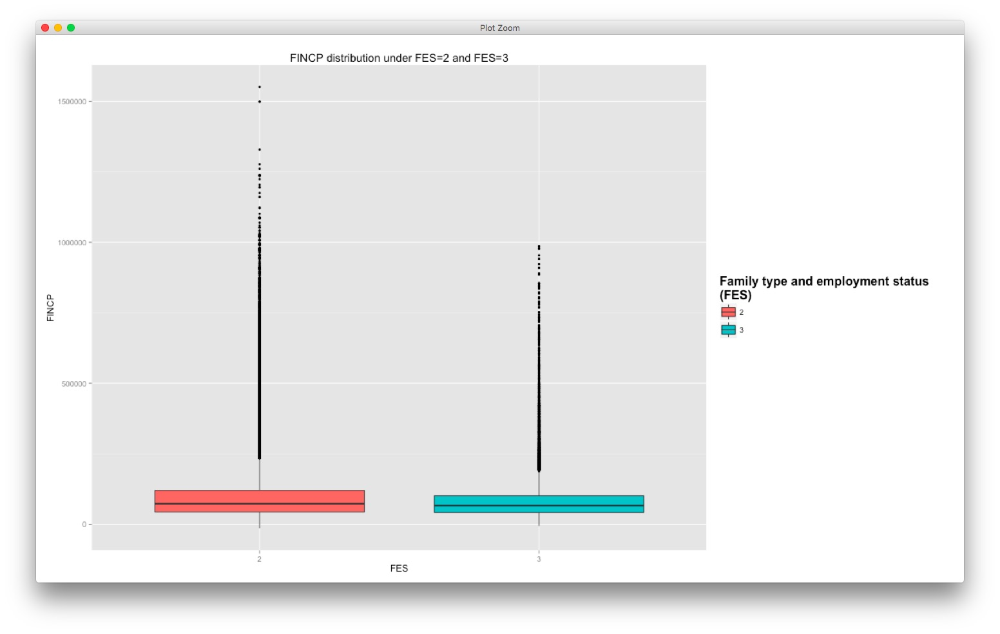
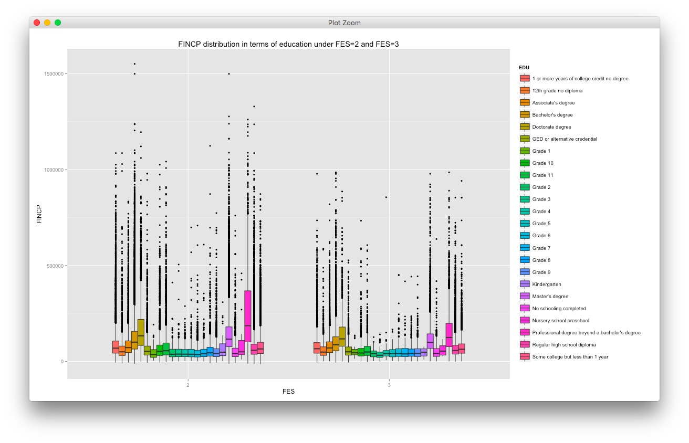
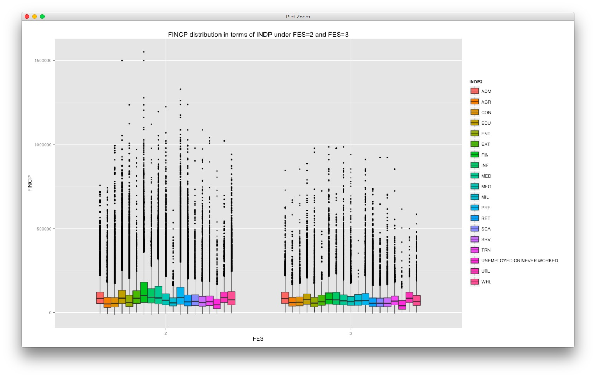

###Below is the 3rd part of the [workflow](https://github.com/TZstatsADS/cycle1-7/blob/master/Ideas%20of%20Topic.md)


###First we load all the packages:
```{r, echo = FALSE, message=FALSE}
library("survey")
library("dplyr")
library("data.table")
library("ggplot2")
library("choroplethr")
library("choroplethrMaps")
```


###Getting the data frame from household data

```{r}
colsToKeep<-c("ST","FINCP","HINCP","FES","SERIALNO","WGTP")

husa <- fread("ss13husa.csv", select=colsToKeep)
husb <- fread("ss13husb.csv", select=colsToKeep)

hus <- rbind(husa,husb) #This is a list
hus <- as.data.frame(hus) #Transform a list to a data frame

#getting the data frame from population data
colsToKeep<-c("ST","SCHL","WAGP","AGEP","INDP","SERIALNO","SEX","PINCP","PWGTP")

pusa <- fread("ss13pusa.csv", select=colsToKeep)
pusb <- fread("ss13pusb.csv", select=colsToKeep)

pus <- rbind(pusa,pusb)
pus <- as.data.frame(pus)

hp <- left_join(hus,pus, by.x="SERIALNO")


hp<-hp %>%
  mutate(INDP2 = NA)

hp$INDP2[hp$INDP>=0170 & hp$INDP<=0290]<-"AGR"
hp$INDP2[hp$INDP>=0370 & hp$INDP<=0490]<-"EXT"
hp$INDP2[hp$INDP>=0570 & hp$INDP<=0690]<-"UTL"
hp$INDP2[hp$INDP==0770]<-"CON"
hp$INDP2[hp$INDP>=1070 & hp$INDP<=3990]<-"MFG"
hp$INDP2[hp$INDP>=4070 & hp$INDP<=4590]<-"WHL"
hp$INDP2[hp$INDP>=4670 & hp$INDP<=5790]<-"RET"
hp$INDP2[hp$INDP>=6070 & hp$INDP<=6390]<-"TRN"
hp$INDP2[hp$INDP>=6470 & hp$INDP<=6780]<-"INF"
hp$INDP2[hp$INDP>=6870 & hp$INDP<=7190]<-"FIN"
hp$INDP2[hp$INDP>=7270 & hp$INDP<=7790]<-"PRF"
hp$INDP2[hp$INDP>=7860 & hp$INDP<=7890]<-"EDU"
hp$INDP2[hp$INDP>=7970 & hp$INDP<=8290]<-"MED"
hp$INDP2[hp$INDP>=8370 & hp$INDP<=8470]<-"SCA"
hp$INDP2[hp$INDP>=8560 & hp$INDP<=8690]<-"ENT"
hp$INDP2[hp$INDP>=8770 & hp$INDP<=9290]<-"SRV"
hp$INDP2[hp$INDP>=9370 & hp$INDP<=9590]<-"ADM"
hp$INDP2[hp$INDP>=9670 & hp$INDP<=9870]<-"MIL"
hp$INDP2[hp$INDP==9920]<-"UNEMPLOYED OR NEVER WORKED"


# 
#                                       
# saveRDS(hp, file="hp.RDS")
# save(hp,file="hp.Rdata")
# 
# #####save the file
# save(pus, file="pus_selected_cols.RData")
# #####

```

###Here we read the data set we just saved:

```{r}
hp<-readRDS("hp.RDS")
hp <-tbl_df(hp)
hp<-na.omit(hp)
```

##Now we draw several boxplots to make comparion between the family income(FINCP) FES=2 and FES=3

1. Primary comparison
```{r}
FINCP_FES23<-hp %>%
             filter(FES %in% c(2,3)) %>%
             select(FES,FINCP)
             
FINCP_FES23$FES <- as.factor(FINCP_FES23$FES)
```
```{r}
p <- ggplot(FINCP_FES23, aes(x=FES, y=FINCP,fill=FES))+geom_boxplot(mapping = NULL, 
     data = NULL, stat = "boxplot", position = "dodge", outlier.colour = "black", 
     outlier.shape = 16, outlier.size = 1.5, notch = FALSE, notchwidth = 0.5)+
     ggtitle("FINCP distribution under FES=2 and FES=3")+scale_fill_discrete(name="Family type and employment status  \n(FES)")+theme(legend.title = element_text(size=16, face="bold"))

p
```


2. Education Level(SCHL)

```{r}

SCHLcode<-"SCHL,EDU
01,No schooling completed
02,Nursery school preschool   
03,Kindergarten
04,Grade 1
05,Grade 2
06,Grade 3        
07,Grade 4
08,Grade 5
09,Grade 6
10,Grade 7        
11,Grade 8  
12,Grade 9
13,Grade 10
14,Grade 11        
15,12th grade no diploma   
16,Regular high school diploma
17,GED or alternative credential
18,Some college but less than 1 year
19,1 or more years of college credit no degree
20,Associate's degree     
21,Bachelor's degree
22,Master's degree
23,Professional degree beyond a bachelor's degree
24,Doctorate degree
"

SCHLcode <- fread(SCHLcode)
#remember the order of the education so that the the plot will also be drawn in this order
order <- SCHLcode$EDU
hp<-left_join(hp, SCHLcode)

FINCP_FES23<-hp %>%
             filter(FES %in% c(2,3)) %>%
             select(FES,FINCP,EDU,SCHL) %>%
             arrange(SCHL)

#set
FINCP_FES23$FES <- as.factor(FINCP_FES23$FES)
FINCP_FES23$EDU <- as.factor(FINCP_FES23$EDU)
```

###Next part is where we draw a box plot to show the distribution of FINCP in terms of education level, both under FES=2 and FES=3
###Use ggplot2 to make a ~~3 dimensional~~ box plot.

```{r}

p <- ggplot(FINCP_FES23, aes(x=FES, y=FINCP,fill=EDU))+geom_boxplot(mapping = NULL, 
     data = NULL, stat = "boxplot", position = "dodge", outlier.colour = "black", 
     outlier.shape = 16, outlier.size = 1.5, notch = FALSE, notchwidth = 0.5)+
     ggtitle("FINCP distribution in terms of education under FES=2 and
             FES=3")

p

```




3. Industry
```{r}
FINCP_FES23<-hp %>%
             filter(FES %in% c(2,3)) %>%
             select(FES,FINCP,INDP2) 

#set
FINCP_FES23$FES <- as.factor(FINCP_FES23$FES)
FINCP_FES23$INDP2 <- as.factor(FINCP_FES23$INDP2)
```


```{r}

p <- ggplot(FINCP_FES23, aes(x=FES, y=FINCP,fill=INDP2))+geom_boxplot(mapping = NULL, 
     data = NULL, stat = "boxplot", position = "dodge", outlier.colour = "black", 
     outlier.shape = 16, outlier.size = 1.5, notch = FALSE, notchwidth = 0.5)+
     ggtitle("FINCP distribution in terms of INDP under FES=2 and FES=3")

p

```


